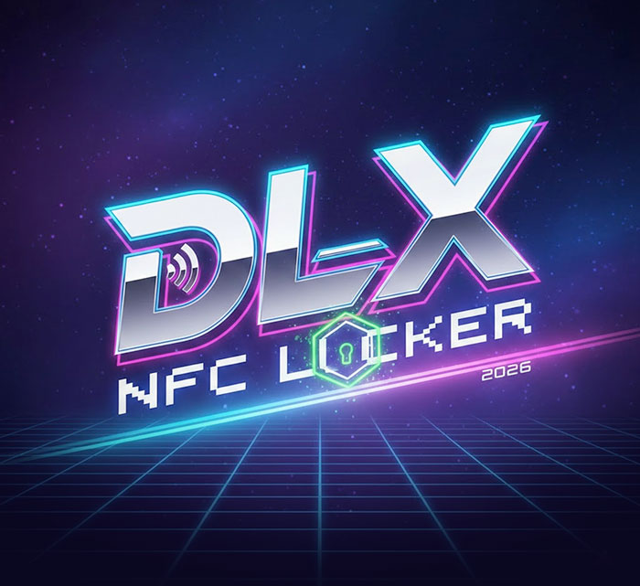

# NFC Card Access Control Service



A Python-based access control system that monitors the presence of authorized Suica/NFC cards using the Sony RC-S380 NFC reader. 
Automatically locks the Windows session if an registered card is not present or removed.


## Features

- **Access Control**: Grants access only to authorized cards.
- **Auto Lock**: Automatically locks the Windows workstation if a card is removed or not present after a timeout.
- **Session Monitoring**: Keeps the session active while the card is present. Pauses monitoring when the workstation is locked.
- **Logging**: Logs access grants and session endings with timestamps (JST).
- **User Management**: Separate tool for easily adding new cards/users.
- **UI**: Top-most, borderless popup overlay for status and countdown.

## Requirements

- Python 3.13+
- Sony RC-S380 NFC Reader
- Standard Sony NFC Port Software (PC/SC drivers)

## Installation

This project uses `uv` for dependency management, but standard `pip` works as well.

### Dependencies
- `pyscard` (Smart card reader communication)
- `pytz` (Timezone handling)
- `Pillow` (Image handling for UI)

### Setup

1. Install dependencies:
   ```bash
   pip install pyscard pytz Pillow
   # OR if using uv
   uv sync
   ```

2. Ensure your Sony RC-S380 reader is connected and drivers are installed.

## Usage

### 1. Register Users

Before running the main lock service, you must register at least one card.

Run the registration tool:
```bash
python add_user.py
```
1. Follow the on-screen prompts.
2. Tap the card on the reader.
3. Enter the user's name.

This updates `authorized_users.json`.

### 2. Run Access Control

Start the card monitor:
```bash
python card_reader_app.py
```

**How it works:**
- The application runs in the background.
- If no card is detected, a popup window appears with a 20-second countdown.
- If an authorized card is placed on the reader:
    - The popup disappears.
    - "Access Granted" is logged.
- If the card is removed:
    - "Session Ended" is logged.
    - The popup reappears and the countdown starts.
- If the countdown reaches zero:
    - **Windows Session is Locked** (`LockWorkStation`).
- When the computer is locked:
    - The monitor pauses/resets (waits for user to unlock via Windows).

## Compilation & Deployment

To run as a standalone application without Python installed, you can compile the scripts into EXEs.

### 1. Build Executables

Install PyInstaller:
```bash
pip install pyinstaller
```

**Main Locker Service (Hidden/Background):**
Runs silently without a console window.
```bash
pyinstaller --onefile --windowed card_reader_app.py
```

**User Manager (Console):**
Requires a terminal for user input.
```bash
pyinstaller --onefile --console add_user.py
```

### 2. Organize Files

The compiled EXEs will appear in the `dist` folder. You must manually copy the required asset files into the `dist` folder so the application can find them.

**Copy these files to `dist`:**
- `app-bg.jpg`
- `authorized_users.json`
- `access_log.txt`

### 3. Install & Autostart

1. **Move to AppData:**
   Create a persistent folder and move all files from `dist` (EXEs + assets) there:
   `C:\Users\<username>\AppData\Local\DLX_NFC_Locker_app`

2. **Set up Task Scheduler:**
   - Open **Task Scheduler** in Windows.
   - Create a **Basic Task**.
   - Trigger: **When I log on**.
   - Action: **Start a program**.
   - Program: Browse to `card_reader_app.exe` in the `DLX_NFC_Locker_app` folder.
   - Finish.

## Files

- `suica_reader.py`: Main access control application.
- `add_user.py`: Utility script to register new cards.
- `authorized_users.json`: Database of authorized users.
- `access_log.txt`: Audit log file.
- `pyproject.toml`: Project configuration and dependencies.

## Log Format

The system logs events in `access_log.txt`:

```
YYYY-MM-DD HH:MM:SS JST | Action | Card: [ID] | User: [Name]
```

Examples:
```
2026-02-04 15:00:00 JST | Access Granted | Card: 0123456789ABCDEF | User: Tanaka
2026-02-04 15:05:00 JST | Session Ended | Card: 0123456789ABCDEF | User: Tanaka
```

## Troubleshooting

- **Reader not found**: Ensure the Sony RC-S380 is connected. If using `pyscard`, ensure the underlying PC/SC service is running (Smart Card service in Windows).
- **Timeout loop**: If the computer locks and immediately unlocks, check if the timeout setting (default 20s) is appropriate.
